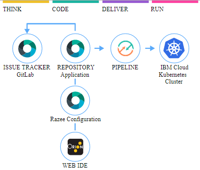

#  Develop a Kubernetes app with Razee

### Continuously deliver a secure container app to a Kubernetes Cluster with Razee
This Hello World application uses Docker with Node.js and includes a DevOps toolchain that is preconfigured for continuous delivery with Vulnerability Advisor, source control, issue tracking, and online editing, a configuration repository, setup scripts that install the Razee agent and application configuration to the IBM Kubernetes Service, and dynamic deployment of Kubernetes resources (e.g. pods) through the Razee agent monitoring the configuration repository.

Application code is stored in source control, along with its Dockerfile and its Kubernetes deployment script.
The target cluster is configured during toolchain setup (using an IBM Cloud API key and cluster name). You can later change these by altering the Delivery Pipeline configuration.
For initial setup of the application, you would need to manually trigger the pipeline Setup stage once, 
and then any code change to the Git repo will automatically be built, validated and deployed into the Kubernetes cluster.

### To get started, click this button:

It implements the following best practices:
- sanity check the Dockerfile prior to attempting creating the image,
- build container image on every Git commit, setting a tag based on build number, timestamp and commit id for traceability
- use a private image registry to store the built image, automatically configure access permissions for target cluster deployment using API tokens than can be revoked,
- check container image for security vulnerabilities,
- insert the built image tag into the deployment manifest automatically,
- use an explicit namespace in cluster to insulate each deployment (and make it easy to clear, by "kubectl delete namespace"),

---
### Learn more 

* [Razee.io](https://razee.io)
* [Step-by-step tutorial](https://www.ibm.com/cloud/garage/tutorials/use-develop-kubernetes-app-with-razee-toolchain)
* [Getting started with clusters](https://cloud.ibm.com/docs/containers?topic=containers-getting-started)
* [Getting started with toolchains](https://cloud.ibm.com/devops/getting-started)
* [Documentation](https://cloud.ibm.com/docs/services/ContinuousDelivery?topic=ContinuousDelivery-getting-started&pos=2)
